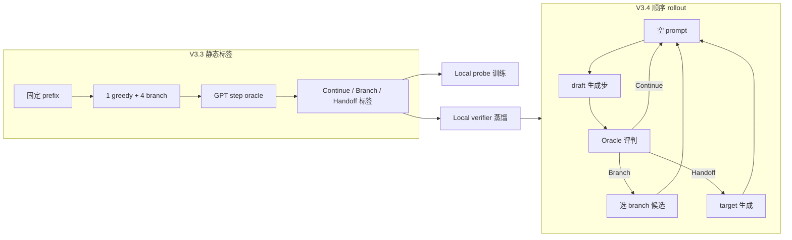

# ReasonBranch

> **Step-level reasoning action study** for SpecReason-style speculative decoding: when should a small **draft** model **Continue**, **Branch** (sample alternatives), or **Handoff** to a large **target** model?

Repository: [github.com/panhongxing-sds/reasonbranch](https://github.com/panhongxing-sds/reasonbranch)

---

## 研究背景

在数学推理的逐步生成中，小模型（draft）每一步可以做出三种策略动作：

| 动作 | 含义 | 典型触发 |
|------|------|----------|
| **Continue** | 接受当前 greedy draft 步，追加到 prefix | Oracle 认为 greedy 步可接受 |
| **Branch** | greedy 不可接受，但从多条 draft 候选中选一条可接受步 | 4 条 branch 候选中至少一条通过 |
| **Handoff** | draft 路径失败，由 target 大模型生成纠正步 | greedy 与 branch 均不可接受 |

本项目围绕三个核心研究问题展开：

1. **Branch-rescuable 状态是否存在？** — 在固定 prefix 上，局部多候选能否救回轨迹？
2. **Sequential cascade** — 在真实多步 rollout 中，\(a_t \to p_{t+1} \to a_{t+1}\)，Branch 能否减少后续 Handoff？
3. **无 API 部署** — 能否用本地 probe / verifier 替代 GPT oracle，在集群上独立运行？



---

## 已完成工作总览（2026-07）

| 阶段 | 状态 | 核心产出 | 能否下机制结论 |
|------|------|----------|----------------|
| **V2** 数据采集 | ✅ 完成 | 1548 prefix、logit 特征、behavior state | 是（描述性） |
| **V3** QwQ utility | ✅ 完成（已弃用） | 0–9 绝对分不稳定 | 否 |
| **V3.2** GPT pairwise | ✅ 完成 | greedy vs best branch 成对比较 | 部分 |
| **V3.3** GPT step oracle | ✅ 完成 | **1395 条稳定动作标签 + 7320 candidate 标签** | **是（主标签资产）** |
| **V3.4** sequential rollout | ✅ pilot 跑通 | 150 rollouts、1067 steps | **否（数据污染）** |
| **V3.4b** 工程修复 | ✅ 代码完成 | 错误码分离、grading、诊断脚本 | 待重跑 |
| **Local probe** | ✅ 初训完成 | S1 AUROC 0.676、S2 AUROC 0.718 | 待 hidden-state 增强 |
| **Local verifier** | ⏳ 脚本就绪 | 7320 条蒸馏数据已导出 | 待 zero-shot eval |

---

## Phase V2 — 数据采集与不确定性刻画

**目标**：在 DeepScaler 子集上采集 prefix + 1 greedy + 4 branch 候选续写，并记录 draft 模型的 logit 不确定性特征。

**已完成**：

- 从 DeepScaler preview 子集采集 **1857** 条 prefix trace，主准入集 **1548** 条（`admission_main`）
- 每条 prefix 记录：1 条 greedy 续写 + 4 条 branch 续写（temperature 采样）
- 导出 entropy、margin、top-k prob、diversity 等 **logit 特征**（`action_study/logits_export.py`）
- 定义 **behavior state** 分类：Stable / Corrupted-recoverable / Corrupted-stuck / Decision-sensitive
- 产出目录：`outputs/action_study_pilot_v2/`（problems, prefixes, actions, traces）

**关键数字**：

| 指标 | 数值 |
|------|------|
| 主准入 prefix | 1548 |
| 4/4 branch 完整 | 1799 |
| 完整 trace 题数 | 517 |

**报告**：[`outputs/pilot_v2_report.md`](outputs/pilot_v2_report.md)

---

## Phase V3 — Utility Oracle（QwQ 0–9，已弃用）

**目标**：用 QwQ-32B 对候选步打 0–9 utility 分，辅助 Branch 决策。

**已完成**：

- 实现 utility scoring 管线（`action_study/specreason_scorer.py`）
- 在固定 prefix 上完成 pilot 打分

**结论**：**0–9 绝对分数不稳定**，不同 prefix 间不可比；不再作为新实验的标签源。后续改用 GPT 成对 / 逐步 oracle。

**报告**：[`outputs/pilot_v3_report.md`](outputs/pilot_v3_report.md)、[`outputs/pilot_v3_audit_report.md`](outputs/pilot_v3_audit_report.md)

---

## Phase V3.2 — GPT Pairwise Oracle

**目标**：GPT-5.5 成对比较 greedy vs best branch，判断哪条更好。

**已完成**：

- `gpt_step_oracle.py` 初版协议
- Pilot 完成，为 V3.3 逐步 oracle 铺路

**报告**：[`outputs/pilot_v3_2_report.md`](outputs/pilot_v3_2_report.md)

---

## Phase V3.3 — GPT Step Oracle（**当前最重要标签资产**）

**目标**：在**固定 prefix** 上，GPT-5.5 独立评判 1 greedy + 4 branch **下一步**是否可接受（`gpt_step_oracle_v2` 协议）。

**已完成**：

- 全量 **1548** prefix 双遍 GPT 评判，稳定率 **94.6%**
- 有效标签 prefix **1395** 条
- 导出 **~7320** 条 candidate-level ACCEPT/REJECT 标签（稳定 pass 的逐步候选）
- 与 V2 behavior state、QwQ weak-branch 做交叉分析

**主结果**：

| 指标 | 数值 | 95% CI |
|------|------|--------|
| Prefix 总数 | 1548 | — |
| 双遍稳定率 | **94.6%** | — |
| 有效标签 prefix | **1395** | 90.1% |
| Continue | 1229 (**88.1%**) | [86.0%, 90.2%] |
| Branch | 74 (**5.3%**) | [4.1%, 6.6%] |
| Handoff | 92 (**6.6%**) | [5.1%, 8.1%] |
| Rescue@4（greedy 被拒时） | **44.6%** | — |
| Rescue@1 | 26.5% | — |

**研究问题回答**：

| RQ | 结论 |
|----|------|
| RQ1 Branch-rescuable 存在？ | **是**（74 次 Branch 事件） |
| RQ2 Branch 率 | 5.3%（eligible） |
| RQ3 Rescue@4 vs Rescue@1 | 44.6% vs 26.5% |
| RQ4 QwQ weak vs GPT Branch | precision **14.5%**，recall 28.4% — **不能替代 GPT** |

**辅助正确率**（非主指标）：Branch 79.7% / Continue 87.2% / Handoff 72.8% 终答正确率。

**报告**：[`outputs/pilot_v3_3_report.md`](outputs/pilot_v3_3_report.md)

---

## Phase V3.4 — Sequential Rollout（**管线验证 pilot，非机制评估**）

**目标**：从**空 prompt** 开始，真实执行多步 Continue / Branch / Handoff，观察 action cascade 是否减少 target intervention。

**已完成**：

- 实现 `sequential_rollout.py` 顺序 rollout 引擎
- 五种 policy：DRAFT_ONLY / TARGET_ONLY / SPECREASON / CONDITIONAL_BRANCH / ALWAYS_BRANCH
- **150 rollouts**（30 题 × 5 policies）、**1067 steps**、**21 次 Branch 事件**
- 双模型常驻：R1-1.5B draft + R1-14B target，H100 80GB ~41GB 显存
- 完整记录 `rollout_summaries.jsonl`、`rollout_steps.jsonl`、转移矩阵、L_B/L_H

**一句话结论**：

> 顺序 rollout **管线跑通了**，但当前结果**还不能**判断 Branch 是否有效。

**污染来源**（导致不能下机制结论）：

| 问题 | 比例 | 影响 |
|------|------|------|
| API 错误被计为 Handoff (`API_ERROR_HANDOFF`) | **53.4%** (335/627) | Handoff 率从 6.6% 膨胀到 74.6% |
| Target 空步 → `PREFIX_UNCHANGED` | **36%** (54/150) | 轨迹异常终止 |
| 正常走到 `FINAL_ANSWER` | **4%** (6/150) | Accuracy 表不可比 |
| Oracle 稳定率（vs V3.3 94.6%） | **45.9%** | 转移矩阵不可信 |
| `extracted_answer` 未回填 summary | 100% 空 | 主表 Accuracy 全 0% |

**表面数字（不可解读）**：SpecReason vs Conditional Branch 平均 ΔHandoff = −1.53（CondBranch 更多 handoff），但混合了 API error 与空步，**不等于 Branch 机制失败**。

**报告**：[`outputs/pilot_v3_4_report.md`](outputs/pilot_v3_4_report.md)

---

## Phase V3.4b — 工程修复（**代码已完成，待干净重跑**）

针对 V3.4 污染问题，已完成以下 P0 工程修复（**无需 API 即可验证部分项**）：

### 1. 技术错误码与策略动作分离

新增 `action_study/technical_errors.py`：

| 错误码 | 含义 | 是否计入策略 Handoff |
|--------|------|---------------------|
| `ORACLE_API_ERROR` | GPT 请求失败 | **否** |
| `TARGET_GENERATION_ERROR` | Target 生成失败 | **否** |
| `STEP_EXTRACTION_ERROR` | 步解析失败 | **否** |
| `PREFIX_UNCHANGED` | Handoff 后 prefix 未变 | **否** |
| `CONTINUE` / `BRANCH` / `HANDOFF` | 策略动作 | 是 |

`valid_for_comparison()` 用于 paired 比较时排除技术失败 rollout。

### 2. Sequential rollout 引擎修复

`action_study/sequential_rollout.py`：

- `StepOracle` 增加重试逻辑，API 失败标 `ORACLE_API_ERROR` 而非 Handoff
- `extract_handoff_step()` / `select_target_handoff_step()` 处理 target 空步
- Grading 回填 `final_answer` / `extracted_answer` / `is_correct` 到 summary
- `gpt_step_oracle.py`：API 重试 4→6 次

### 3. R1 模型 think 块处理

`action_study/step_extraction.py`：

- `strip_model_thinking()` 剥离 `` 块
- `extract_handoff_step()` 从 target 原始输出提取有效推理步

### 4. Grading 回归测试

`action_study/grading_regression.py` — 50 条 V2 trace 回归：

| 指标 | 结果 |
|------|------|
| 可评分率 | **88%** |
| 可评分子集 accuracy | **79.5%** |
| `\boxed{}` 检出率 | 90% |

产物：`outputs/grading_regression/`

### 5. Target 空步诊断

`action_study/target_step_diagnostic.py` — 100 个 prefix 独立采样：

| 指标 | 结果 |
|------|------|
| 非空步率 | **100%** (100/100) |
| 配置 | max_tokens=384, max_model_len=4096 |

说明：V3.4 的 36% `PREFIX_UNCHANGED` 更可能来自 **rollout 上下文/步格式约束**，而非 target 模型本身不能生成；修复后需在 sequential 设置下复验。

产物：`outputs/target_step_diagnostic/`

### 6. 本地无 API 管线

`scripts/run_local_pipeline.sh` 一键执行：

```bash
bash scripts/run_local_pipeline.sh
# 步骤：grading 回归 → target 诊断 → probe 数据导出 → probe 训练 → verifier 数据导出
```

---

## Local Probe — V3.3 标签 + V2 logit 特征（无 API）

**设计**：两阶段 problem-level GroupKFold（防同题泄漏）

| Stage | 任务 | 样本 | OOF AUROC | PR-AUC | 备注 |
|-------|------|------|-----------|--------|------|
| **S1** | Continue vs Intervention | 1395 | **0.676** | 0.188 | intervention recall 0.51 |
| **S2** | Branch vs Handoff | 166 | **0.718** | 0.615 | Branch recall 0.64 |

**特征**：entropy, margin, top1/top2 prob, diversity, prefix 长度, Wait/But marker 等（来自 V2 logit 导出）。

**代码**：`build_probe_dataset.py`、`train_local_probe.py`（numpy logistic + GroupKFold）

**产物**：`outputs/probe_datasets/`、`outputs/probe_models/`

**下一步**：hidden-state probe（`export_hidden_pass.sh`）、MLP / hidden+logit 联合特征。

---

## Local Verifier 蒸馏 — 无 API 部署关键路径

**目标**：用 14B 本地模型替代 GPT oracle，实现 SpecReason / Conditional Branch 无 API rollout。

**已完成**：

- 从 V3.3 稳定 GPT 标签导出 **7320** 条 `(problem, prefix, candidate) → ACCEPT/REJECT`
- `local_step_verifier.py`：14B zero-shot 二分类 prompt 骨架
- `build_verifier_dataset.py`：candidate 标签导出

**达标门槛**（zero-shot 未通过则 LoRA/SFT）：

| 指标 | 目标 |
|------|------|
| Action agreement | ≥ 85% |
| Branch precision | ≥ 70% |

**状态**：脚本就绪，待 GPU 跑 zero-shot eval。

---

## Reachable State Pilot

**目标**：验证 target 模型能否从 draft prefix replay 到达正确终答。

**报告**：[`outputs/reachable_state_report.md`](outputs/reachable_state_report.md)

---

## 项目结构

```
reasoning_branch_dataset/
├── action_study/                    # 核心实验代码
│   ├── pipeline.py                  # V2 数据采集管线
│   ├── gpt_step_oracle.py           # V3.3 GPT 逐步 oracle 协议
│   ├── sequential_rollout.py        # V3.4 顺序 rollout 引擎
│   ├── technical_errors.py          # 技术失败 vs 策略动作分离
│   ├── step_extraction.py           # R1 think 块 + handoff 步提取
│   ├── build_probe_dataset.py       # 两阶段 probe 数据导出
│   ├── train_local_probe.py         # 本地 probe 训练（无 API）
│   ├── build_verifier_dataset.py    # Verifier 蒸馏数据
│   ├── local_step_verifier.py       # 14B 本地 ACCEPT/REJECT verifier
│   ├── target_step_diagnostic.py    # Target 空步诊断
│   ├── grading_regression.py        # Grading 回归测试
│   └── specreason_scorer.py         # V3 QwQ utility（已弃用）
├── scripts/                         # 26 个可执行入口脚本
│   ├── run_local_pipeline.sh        # ★ 无 API 本地管线（推荐）
│   ├── run_v3_3_gpt_step_oracle.sh  # V3.3 GPT 打标
│   ├── run_v3_4b.sh                 # V3.4b 修复后 rollout
│   └── common.sh                    # 统一 AFS/API/vLLM 环境
├── tests/                           # 单元测试
├── docs/                            # 设计文档 & ROADMAP
├── data/                            # 小数据集 + 下载说明
└── outputs/                         # 实验报告（入库）+ 大文件（gitignore）
    ├── INDEX.md                     # 报告索引
    ├── pilot_v3_3_report.md         # ★ 主标签报告
    ├── pilot_v3_4_report.md         # Sequential pilot（含污染警示）
    ├── probe_models/                # Local probe 结果
    ├── grading_regression/          # Grading 回归
    └── target_step_diagnostic/      # Target 诊断
```

**包导入**：目录名是 `reasoning_branch_dataset`，需将**父目录**加入 `PYTHONPATH`：

```bash
export AFS=/path/to/workspace    # 包含 reasoning_branch_dataset/ 的目录
export PYTHONPATH="${AFS}"
```

---

## 实验入口

| 阶段 | 命令 | 需要 API | 需要 GPU |
|------|------|:--------:|:--------:|
| V2 数据采集 | `bash scripts/run_batch.sh` | 可选 | 是 |
| V3.3 GPT step oracle | `bash scripts/run_v3_3_gpt_step_oracle.sh` | **是** | 否 |
| V3.4 sequential rollout | `bash scripts/run_v3_4b.sh` | **是** | 是 |
| **本地管线（推荐）** | `bash scripts/run_local_pipeline.sh` | **否** | 部分 |
| Grading 回归 | `python -m reasoning_branch_dataset.action_study.grading_regression` | 否 | 否 |
| Target 诊断 | `python -m reasoning_branch_dataset.action_study.target_step_diagnostic` | 否 | 是 |
| Probe 训练 | `python -m reasoning_branch_dataset.action_study.train_local_probe` | 否 | 否 |

### 环境配置

```bash
export AFS=/path/to/workspace
export PYTHONPATH="${AFS}"
export HF_ENDPOINT="${HF_ENDPOINT:-https://hf-mirror.com}"

# API（仅 oracle 实验需要）
cp scripts/env.example .env
# 设置 TEACHER_API_KEY 或 TEACHER_KEYFILE
source scripts/load_api_env.sh
```

### 模型路径（不在 repo 内，需自行下载）

| 角色 | 推荐模型 | 单卡显存（bf16） |
|------|----------|-----------------|
| Draft | DeepSeek-R1-Distill-Qwen-1.5B | ~4 GB |
| Target | DeepSeek-R1-Distill-Qwen-14B | ~28 GB |
| Target（更强） | DeepSeek-R1-Distill-Qwen-32B | ~64 GB |

**显存参考（双常驻 draft + target）**：

| 硬件 | 14B + 1.5B | 32B bf16 + 1.5B |
|------|:----------:|:---------------:|
| H100 80GB | ✅ ~41GB（已验证） | ❌ OOM |
| A6000 110GB | ✅ | ✅ ~80–90GB |
| 2× 40GB | 分卡可行 | GPU0=32B, GPU1=1.5B |

```bash
bash scripts/download_r1_14b.sh
bash scripts/download_r1_32b_awq.sh   # 可选 AWQ 版
```

---

## 报告索引

完整列表：[`outputs/INDEX.md`](outputs/INDEX.md)

| 版本 | 报告 | 内容 |
|------|------|------|
| V2 | `pilot_v2_report.md` | 数据采集、不确定性、behavior state |
| V3 | `pilot_v3_report.md` | QwQ utility（已弃用） |
| V3 audit | `pilot_v3_audit_report.md` | Step quality audit |
| V3.2 | `pilot_v3_2_report.md` | GPT pairwise |
| **V3.3** | `pilot_v3_3_report.md` | **GPT step oracle 主标签** |
| **V3.4** | `pilot_v3_4_report.md` | Sequential rollout pilot（含污染分析） |
| Reachable | `reachable_state_report.md` | Target replay 可达性 |

---

## 路线图

当前优先级（**无需 API 直到 local verifier 达标**）：

```
修管线 ✅ → 训练 V3.3 local probe ✅ → GPT 标签蒸馏本地 verifier ⏳ → V3.4b local rollout
```

详见 [`docs/ROADMAP.md`](docs/ROADMAP.md)

### 明确不做

- 用污染后的 V3.4 数字下「Branch 无效」结论
- 把 V3.3 静态标签直接当 sequential 训练标签
- 继续用 QwQ 0–9 构造新标签

### 待完成

| 任务 | 依赖 |
|------|------|
| Local verifier zero-shot eval | GPU |
| V3.4b 干净重跑（SpecReason vs CondBranch） | API 恢复 或 verifier 达标 |
| Hidden-state probe | `export_hidden_pass.sh` |
| 双卡分卡模式（2×40GB） | 代码实现 `CUDA_VISIBLE_DEVICES` |
| 扩大样本（100+ 题，多 seed） | 上述完成 |

---

## 测试

```bash
cd "${AFS}"
python -m pytest reasoning_branch_dataset/tests/ -q
```

---

## 大文件与复现

以下**不入库**（见 `.gitignore`），需本地生成或下载：

| 类型 | 路径 | 大小/说明 |
|------|------|-----------|
| 实验原始数据 | `outputs/**/*.jsonl` | 需脚本重跑 |
| 数据集 | `data/deepscaler_preview.jsonl` | ~21MB，见 [`data/README.md`](data/README.md) |
| 模型权重 | `specreason/models/` | 集群本地 |
| 日志 | `logs/` | 运行时生成 |
| 密钥 | `.env`, `key/` | **永不提交** |

**入库内容**：全部 Python 代码、shell 脚本、设计文档、**实验报告 markdown**、小 summary JSON。

---

## 引用与联系

- GitHub: [panhongxing-sds/reasonbranch](https://github.com/panhongxing-sds/reasonbranch)
- 基于 SpecReason 风格的 speculative reasoning + step-level action control
